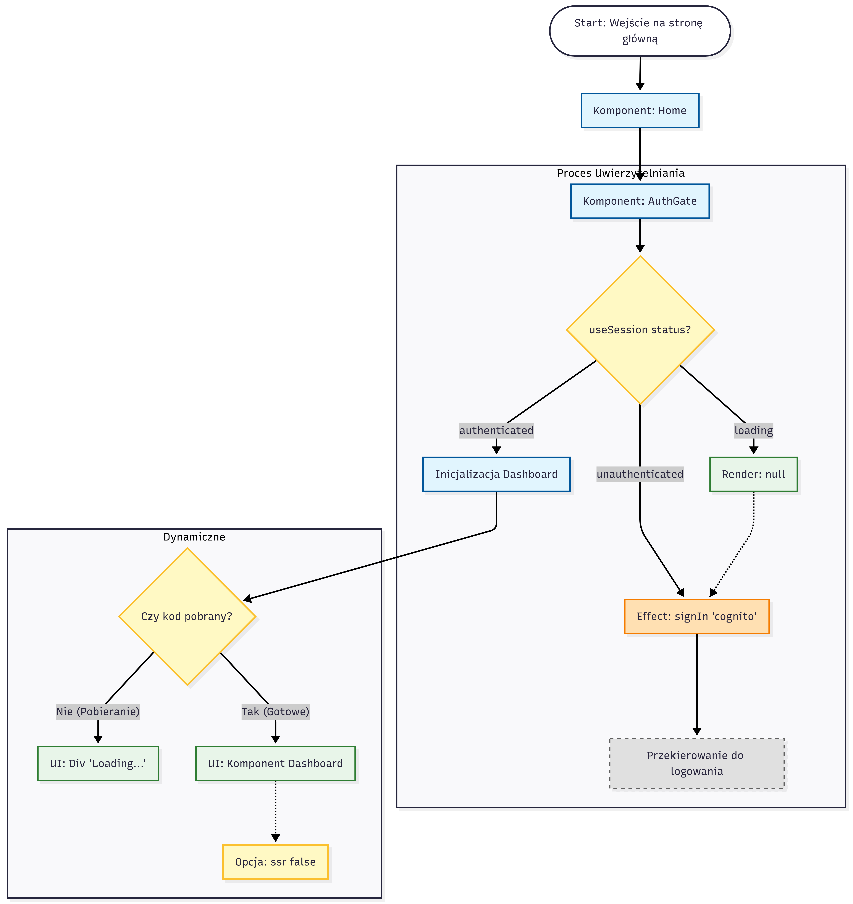

# Zestawienie Diagramów

## Diagram Administratora

---

## Diagram Akwarium

---

## Diagram Kontakt

---

## Diagram Klas

---

## Diagram Komponentów

---

## Diagram Główny (Main)

---

## Diagram Rośliny

---

## Diagram Ryby

---

## Diagram Sekwencji (Całość)
